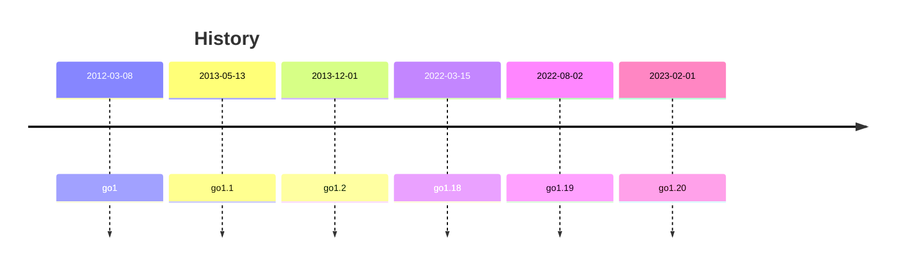

# Go

[website](https://go.dev/) | [playground](https://go.dev/play/) | [github](https://github.com/golang/go) | [twitter](https://twitter.com/golang)

- release history: https://go.dev/doc/devel/release
- proposal review meetings: https://github.com/golang/go/issues/33502
- standard library: https://pkg.go.dev/std
- go command: https://pkg.go.dev/cmd/go
- go modules: https://go.dev/ref/mod
- memory model: https://go.dev/ref/mem

## Release Notes:

[go1.21.0 (2023-08-08)](https://go.dev/doc/go1.21) | [go1.20 (2023-02-01)](https://go.dev/doc/go1.20) | [go1.19 (2022-08-02)](https://go.dev/doc/go1.19) | [go1.18 (2022-03-15)](https://go.dev/doc/go1.18) | [go1.17 (2021-08-16)](https://go.dev/doc/go1.17)

## Style Guides

- [Effective Go](https://go.dev/doc/effective_go)
- [Go Code Review Comments](https://github.com/golang/go/wiki/CodeReviewComments)
- [Google Go Style Guide](https://google.github.io/styleguide/go/)
- [Uber Go Style Guide](https://github.com/uber-go/guide)
- [CockroachDB Go Style Guide](https://wiki.crdb.io/wiki/spaces/CRDB/pages/181371303/Go+Golang+coding+guidelines)
- [Thanos Go Style Guide](https://thanos.io/tip/contributing/coding-style-guide.md)
- [Mattermost Go Style Guide](https://developers.mattermost.com/contribute/more-info/server/style-guide/)

## Language Specification

- https://go.dev/ref/spec

Notes:

- Switch statements: expression switches and type switches.
- A "select" statement chooses which of a set of possible send or receive operations will proceed.
- A "break" statement terminates execution of the innermost "for", "switch", or "select" statement within the same function.
- The length of a nil slice, map or channel is 0. The capacity of a nil slice or channel is 0.
- Receiving from a nil channel blocks forever.
- Slice, map, and function types are not comparable. However, as a special case, a slice, map, or function value may be compared to the predeclared identifier nil.

## Documentation

- [FAQ](https://go.dev/doc/faq)
- [Go Doc Comments](https://go.dev/doc/comment)
- [A Guide to the Go Garbage Collector](https://go.dev/doc/gc-guide)
- [Deprecation of 'go get' for installing executables](https://go.dev/doc/go-get-install-deprecation)

## Blog

- [The Go Blog](https://go.dev/blog/)
- [(31 March 2011) Godoc: documenting Go code](https://go.dev/blog/godoc)
- [(12 July 2018) Getting to Go: The Journey of Go's Garbage Collector](https://go.dev/blog/ismmkeynote)
- [(26 September 2022) Go runtime: 4 years later](https://go.dev/blog/go119runtime)

```shell
go install golang.org/x/tools/cmd/godoc@latest
```



## [go1.18] Append to slice

```
runtime: make slice growth formula a bit smoother

Instead of growing 2x for < 1024 elements and 1.25x for >= 1024 elements,
use a somewhat smoother formula for the growth factor. Start reducing
the growth factor after 256 elements, but slowly.
```

https://github.com/golang/go/commit/2dda92ff6f9f07eeb110ecbf0fc2d7a0ddd27f9d
